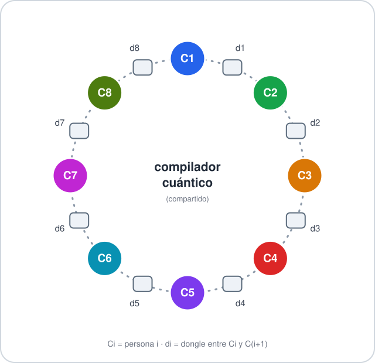

*Este proyecto ha sido creado como parte del currículo de 42 por saperez-.*

# Codexion

Domina la carrera por los recursos antes de que la fecha límite te domine a ti.

## Descripción

Codexion es una simulación de concurrencia escrita en C con hilos POSIX
(`pthread`) que representa a `number_of_coders` personas que programan
sentadas en una mesa circular de co-working. En el centro de la mesa hay un
compilador cuántico compartido y, sobre la mesa, tantos **dongles USB** como
personas: cada persona tiene un dongle a su izquierda y otro a su derecha.

Cada persona repite indefinidamente el mismo ciclo:

1. **Compilar** (`is compiling`): necesita sostener simultáneamente su dongle
   izquierdo y su dongle derecho durante `time_to_compile` ms.
2. **Depurar** (`is debugging`): durante `time_to_debug` ms, sin recursos.
3. **Refactorizar** (`is refactoring`): durante `time_to_refactor` ms, sin
   recursos. Al terminar, intenta compilar de nuevo inmediatamente.

Si una persona no consigue **empezar** a compilar dentro de
`time_to_burnout` ms desde el inicio de su última compilación (o desde el
arranque de la simulación), se agota (`burned out`) y la simulación se
detiene. Si, en cambio, todas las personas llegan a compilar al menos
`number_of_compiles_required` veces, la simulación se detiene también, pero
sin que nadie se haya agotado.

El objetivo del proyecto es coordinar el acceso a los dongles evitando dos
problemas clásicos de la concurrencia: el **interbloqueo** (deadlock) y la
**inanición** (starvation), respetando además un periodo de enfriamiento
obligatorio (`dongle_cooldown`) tras cada liberación de un dongle.

## Cómo "vive" la ejecución

### La mesa es literalmente un anillo

Cada persona (`Ci`) solo puede ver y tocar los dos dongles que tiene al lado
(`di`), y cada dongle es compartido exactamente por sus dos vecinas. No hay
"centro" ni "extremos": el hilo de la persona `1` y el de la última
(`number_of_coders`) también son vecinos entre sí. El ejemplo siguiente
dibuja el caso `number_of_coders = 8`, pero la forma es la misma para
cualquier `n`: un polígono cerrado de `n` personas alternadas con `n`
dongles, cada uno compartido por sus dos vecinos.



`Ci` es el hilo de la persona `i` (`coder_routine` en `coder_routine.c`) y
`di` el dongle entre `Ci` y `C(i+1 mod n)` (`t_dongle`, creado en
`sim_builders.c`). Para compilar, `Ci` necesita sostener a la vez el dongle
que tiene a su izquierda y el que tiene a su derecha; como esos dos dongles
también son los que necesitan sus dos vecinas para compilar ellas, la
contención siempre es local (con el vecino inmediato), nunca global — pero
al ser un anillo cerrado, esa contención local se puede propagar dando toda
la vuelta a la mesa, que es justo lo que abre la puerta al interbloqueo y a
la inanición que evita el planificador (ver "Casos de bloqueo gestionados"
más abajo).

### El ciclo de vida de cada persona

En paralelo a esa geometría, cada hilo de persona recorre siempre el mismo
ciclo mientras la simulación siga viva:

```
┌──────────────┐   ┌──────────────┐   ┌────────────────┐
│ is compiling │──▶│ is debugging │──▶│ is refactoring │
└──────────────┘   └──────────────┘   └────────────────┘
       ▲                                      │
       └──────────────────────────────────────┘
```

El único punto de salida de este bucle es el hilo `monitor`, que corre en
paralelo y vigila a todo el mundo: si una persona tarda más de
`time_to_burnout` ms en volver a conseguir sus dos dongles (contando desde
que empezó su último `is compiling`), la saca del bucle con `burned out` y
para toda la simulación de golpe; si en cambio todas llegan a
`number_of_compiles_required` compilaciones, el `monitor` para la
simulación igualmente, pero sin que nadie se haya agotado.

## Instrucciones

### Compilación

```sh
cd coders
make
```

El `Makefile` genera el binario `codexion` a partir de los fuentes en
`coders/` usando `cc` con las flags `-Wall -Wextra -Werror -pthread`, sin
relink innecesario. Reglas disponibles: `all`, `clean`, `fclean`, `re`, `try`.

```sh
make clean   # elimina los .o
make fclean  # elimina los .o y el binario
make re      # fclean + all
make try     # crea y testea el programa con unos valores de prueba
```

### Ejecución

```sh
./codexion number_of_coders time_to_burnout time_to_compile time_to_debug \
           time_to_refactor number_of_compiles_required dongle_cooldown scheduler
```

| Argumento | Descripción |
|---|---|
| `number_of_coders` | Número de personas que programan (y de dongles sobre la mesa). |
| `time_to_burnout` | Milisegundos sin empezar a compilar antes de agotarse. |
| `time_to_compile` | Milisegundos que dura una compilación (con los dos dongles en la mano). |
| `time_to_debug` | Milisegundos que dura la fase de depuración. |
| `time_to_refactor` | Milisegundos que dura la fase de refactorización. |
| `number_of_compiles_required` | Nº de compilaciones que debe alcanzar cada persona para que la simulación termine con éxito. |
| `dongle_cooldown` | Milisegundos que un dongle permanece no disponible tras ser liberado. |
| `scheduler` | Política de arbitraje cuando varios coders compiten por el mismo dongle: `fifo` o `edf`. |

Todos los argumentos son obligatorios y deben ser enteros válidos (los
tiempos, `number_of_coders`, `number_of_compiles_required` y
`dongle_cooldown` deben ser estrictamente positivos; `scheduler` debe ser
exactamente `fifo` o `edf`). Cualquier entrada inválida se rechaza con un
mensaje de error y el programa termina con código 1 sin lanzar ningún hilo.

Ejemplos:

```sh
./codexion 5 800 200 200 200 3 100 fifo
./codexion 4 4000 500 500 500 5 100 edf
```

### Formato de los logs

Cada cambio de estado se imprime como:

```
timestamp_in_ms X has taken a dongle
timestamp_in_ms X is compiling
timestamp_in_ms X is debugging
timestamp_in_ms X is refactoring
timestamp_in_ms X burned out
```

donde `timestamp_in_ms` es el tiempo transcurrido desde el arranque de la
simulación y `X` el identificador de la persona (de `1` a
`number_of_coders`). Para facilitar la lectura en terminal, cada persona
imprime su log en un color ANSI distinto (`\033[3Xm` ... `\033[0m`). Si se
necesita procesar la salida con un script externo, estos códigos de escape
deben filtrarse antes, por ejemplo con:

```sh
./codexion 5 800 200 200 200 3 100 fifo | sed -E 's/\x1b\[[0-9;]*m//g'
```

Estas cinco líneas son las **únicas** que el programa imprime: no hay ningún
mensaje adicional de inicio, resumen o final de simulación (con éxito o con
`burned out`) fuera de este formato, ni siquiera en `main.c`, que en caso de
éxito termina en silencio con código `0`. Esto es deliberado: un mensaje
final que no siga el formato `timestamp_in_ms X evento` rompería el
supuesto (documentado aquí mismo) de que toda la salida se ajusta a esas
cinco líneas, y con él cualquier script que la filtre o la parsee línea a
línea. Además, tras un `burned out`, `sim->can_write` se pone a `0`
(`log_event` en `log.c`) para garantizar que no se imprime absolutamente
nada más — ni siquiera en formato correcto — una vez detectado el
agotamiento; la comprobación y el cambio de `can_write` ocurren dentro de
la misma sección protegida por `sim->mutex_log` que el propio `printf`,
así que ningún otro hilo puede colarse con un log intermedio entre que se
imprime "burned out" y se cierra la puerta a más escrituras.

## Elegir parámetros viables

El enunciado garantiza que, bajo el planificador `edf`, nadie debe agotarse
*"siempre que los parámetros sean viables"*. Esta sección explica qué
significa "viable" en números concretos, para poder elegir (o generar)
argumentos de prueba con la certeza de que el programa debería completarlos
sin agotamientos.

### 1. Cota dura: el mínimo para que todo el mundo compile una vez

Con `number_of_coders` (`n`) personas sentadas en el hub circular, solo
`floor(n / 2)` pueden compilar a la vez (cada compilación necesita 2 dongles
adyacentes, y dos personas solo pueden compilar en paralelo si no comparten
ninguno). El tiempo mínimo posible, con el mejor reparto imaginable, para que
**todas** las personas compilen al menos una vez es:

```
tiempo_mínimo = ceil(n / floor(n / 2)) × time_to_compile
```

Si `time_to_burnout` es menor o igual que este valor, el agotamiento de
alguien es matemáticamente inevitable, sin importar cómo de bueno sea el
planificador. Por debajo de esta cota no hay forma de que el programa evite
el agotamiento — no es un fallo de implementación, es un límite del propio
problema.

### 2. Sostenibilidad a largo plazo

La cota anterior solo garantiza la **primera** ronda de compilaciones. Si la
simulación tiene que sostenerse durante muchas rondas (`number_of_compiles_required`
alto), también hay que evitar que el sistema esté saturado a largo plazo. Sin
contención, cada persona querría compilar una fracción
`time_to_compile / (time_to_compile + time_to_debug + time_to_refactor)`
del tiempo total. Esa fracción tiene que caber en la capacidad real
disponible:

```
time_to_compile / (time_to_compile + time_to_debug + time_to_refactor)  ≤  floor(n / 2) / n
```

Si esta desigualdad no se cumple, la demanda de compilación supera lo que el
sistema puede servir de forma sostenida: la cola de espera crece sin límite
con el tiempo, y ningún valor de `time_to_burnout`, por grande que sea,
evita el agotamiento eventual en una simulación suficientemente larga.

### Margen recomendado

Cumplir ambas condiciones al límite exacto (margen 0) es frágil: cualquier
`dongle_cooldown` no nulo, o el jitter normal de la planificación del
sistema operativo, puede bastar para tumbarlo. Se recomienda un
`time_to_burnout` con al menos un 50% de margen sobre la cota dura del
punto 1, además de cumplir la desigualdad de sostenibilidad del punto 2.

### Ejemplos con los valores mínimos que acepta el programa

El programa exige `number_of_coders ≥ 1`, `number_of_compiles_required ≥ 1`,
y el resto de tiempos `≥ 0` (ver `check_args.c`).

**Ejemplo 1 — mínimo absoluto (`n = 1`):**

```sh
./codexion 1 0 0 0 0 1 0 fifo
```

Con una sola persona, `floor(1 / 2) = 0`: no hay compilación posible en
ningún caso (hacen falta 2 dongles simultáneos y solo hay 1 sobre la mesa).
La fórmula del punto 1 no se puede aplicar (división por `floor(n/2)=0`) —
es un caso degenerado a propósito: la persona se agota siempre,
inmediatamente, sin llegar nunca a compilar. Salida real:

```
1 1 has taken a dongle
1 1 burned out
```

**Ejemplo 2 — el `n` más pequeño en el que sí se puede compilar (`n = 2`):**

Con `n = 2`, `floor(2/2) = 1` y la cota dura es
`ceil(2/1) × time_to_compile = 2 × time_to_compile`.

Con `time_to_compile = 10`, el mínimo teórico es `20`. Usar exactamente ese
valor como `time_to_burnout` (margen 0) es frágil por definición (ver
apartado anterior) y en el pasado, con una versión anterior del scheduler
`edf`/`fifo`, llegó a fallar de forma sistemática. Con la lógica de
adquisición actual (ver "Casos de bloqueo gestionados" más abajo) este caso
límite se ha vuelto notablemente más robusto en la práctica — en tandas de
20 ejecuciones consecutivas no se ha observado ningún agotamiento —, pero
sigue siendo un margen 0 y por tanto **no es una garantía**: sigue
dependiendo de la carga de la máquina y no debe usarse como caso de prueba
fiable:

```sh
./codexion 2 20 10 0 0 3 0 fifo
# margen 0: puede fallar de forma intermitente según la carga del sistema
```

Añadiendo el margen recomendado (`time_to_burnout = 30`, un 50% por encima
del mínimo) la simulación se completa siempre sin agotamientos, y esta sí es
una garantía estable en la que apoyarse para pruebas:

```sh
./codexion 2 30 10 0 0 3 0 fifo
# 0/N tiradas terminan en "burned out"
```

### Límites para otros valores de `n`

Aplicando la misma fórmula (`ceil(n / floor(n/2))` para la cota dura,
`floor(n/2) / n` para la fracción de sostenibilidad):

| `n` | `floor(n/2)` | cota dura                  | fracción de sostenibilidad |
|-----|--------------|-----------------------------|-----------------------------|
| 1   | 0            | no aplica (nunca compila)   | 0                           |
| 2   | 1            | `2 × time_to_compile`       | `1/2 = 0.50`                |
| 3   | 1            | `3 × time_to_compile`       | `1/3 ≈ 0.33`                |
| 5   | 2            | `3 × time_to_compile`       | `2/5 = 0.40`                |

Estas cotas son heurísticas basadas en un reparto ideal, no garantías
exactas para cualquier combinación de parámetros: casos con
`number_of_compiles_required` bajo pueden sobrevivir incluso incumpliendo
la fracción de sostenibilidad del punto 2 (simplemente no da tiempo a que
la cola crezca lo suficiente).

## Casos de bloqueo gestionados

- **Prevención de interbloqueo (condiciones de Coffman)**: cada scheduler
  rompe la espera circular a su manera. En `fifo`
  (`order_dongles_fifo` en `dongle_acquire_fifo.c`) se invierte el orden de
  adquisición según la paridad del identificador: las personas con id par
  cogen primero su dongle izquierdo y luego el derecho; las impares, al
  revés. En `edf` (`order_dongles` en `dongle_topology.c`) se usa en su
  lugar un orden global fijo (siempre el dongle de id menor antes que el de
  id mayor) combinado con una adquisición **atómica** del par completo (ver
  siguiente punto): nunca se sostiene un solo dongle del par a la espera del
  otro, así que no hay hold-and-wait que romper.
- **Prevención de inanición**: cada dongle mantiene su propia cola de espera
  implementada como *min-heap* (`heap.c` / `heap_utils.c` /
  `heap_lookup.c`). Con `fifo`, la clave es un contador de llegada creciente
  (`compute_key` en `dongle_acquire.c`), por lo que la solicitud más antigua
  siempre gana ese dongle en concreto. Con `edf`, la clave es
  `(last_compile_start_ms + time_to_burnout) * 1000 + coder->id`: el
  *deadline* de agotamiento con el id como desempate determinista
  incrustado en la propia clave numérica (para no depender del orden
  interno del heap cuando dos personas empiezan con el mismo deadline).
  A diferencia de `fifo`, en `edf` los dos dongles de una persona se piden y
  se sueltan siempre juntos, nunca por separado
  (`dongle_acquire_pair_edf` en `dongle_acquire_edf.c`): o se consiguen los
  dos a la vez o no se consigue ninguno, evitando que alguien acapare un
  dongle en exclusiva mientras se queda atascado esperando el otro.

  La comprobación de si un dongle está listo para una persona
  (`edf_dongle_ready`) no exige estar literalmente a la cabeza de la cola de
  ese dongle, sino que exige que **nadie con mejor prioridad que pueda
  usarlo ahora mismo** lo esté esperando: si hay un rival con deadline más
  urgente en cola pero ese rival sigue bloqueado en su otro dongle (todavía
  ocupado o en cooldown), dejar pasar a la persona actual no le quita nada
  al rival y evita que el dongle quede libre sin usar. Esta es la corrección
  clave sobre una primera versión más ingenua que exigía ser la cabeza estricta
  de la cola en *ambos* dongles del par:
  bajo esa regla, un dongle físicamente libre podía quedar
  desperdiciado — nadie lo tomaba porque el cabeza de cola "legítimo" no
  podía usarlo todavía —, reduciendo el throughput real y arriesgando
  agotamientos evitables incluso con parámetros viables.

  Para poder consultar con seguridad el estado del *otro* dongle del rival
  sin condiciones de carrera (TOCTOU), la adquisición EDF bloquea de forma
  atómica y en orden ascendente de id hasta 4 mutexes a la vez — el propio
  par más, si existen, el dongle "pareja" de cada rival —, calculados en
  `build_lock_set` y tomados/soltados con `lock_set`
  (`dongle_lock_set.c`), antes de decidir si toma el par o no.
- **Gestión del cooldown**: al liberar un dongle (`dongle_release` en
  `dongle.c`) se marca `aviable_at_ms = ahora + dongle_cooldown`; el dongle
  no puede volver a tomarse hasta que el temporizador expire, comprobado
  directamente (`now < dongle->aviable_at_ms`) en `dongle_ready`
  (`dongle_acquire_fifo.c`) y en `edf_dongle_ready`
  (`dongle_acquire_edf.c`), con el tiempo de espera restante calculado en
  `dongle_wait_hint` (`dongle_acquire.c`).
- **Detección precisa del agotamiento**: un hilo `monitor` independiente
  (`monitor.c` / `monitor_utils.c`) calcula en cada vuelta el instante de
  agotamiento más próximo entre todas las personas
  (`next_burnout_deadline`) y espera hasta ese instante exacto con
  `pthread_cond_timedwait` sobre la misma señal de progreso compartida que
  usa `edf` (`sim->cond_progress`, ver más abajo): así se despierta al
  momento ante cualquier avance en la simulación y, si no hay ninguno,
  como muy tarde en el propio deadline de agotamiento, cumpliendo el margen
  de 10 ms exigido por el enunciado sin necesidad de un sondeo a ciegas
  cada milisegundo.
- **Serialización del log**: todas las escrituras a stdout pasan por
  `log_event` (`log.c`), protegido por un único mutex (`sim->mutex_log`), de
  modo que dos mensajes nunca se entremezclan en la misma línea.
- **Caso límite `number_of_coders = 1`**: al haber un único dongle sobre la
  mesa, esa persona nunca puede sostener dos dongles a la vez (necesitaría
  tomar el mismo dongle dos veces), por lo que jamás llega a compilar y
  termina agotándose de forma determinista, sin que el programa quede
  bloqueado de forma indefinida ni sin control (el hilo `monitor` detecta el
  agotamiento igualmente y detiene la simulación).

## Mecanismos de sincronización entre hilos

- **`pthread_mutex_t` por dongle** (`t_dongle.mutex`): protege el estado
  completo de cada dongle (`taked`, `aviable_at_ms`, `arrival_counter` y su
  heap de espera `waiting`). Toda lectura o escritura de estos campos ocurre
  con el mutex tomado (`dongle_acquire`, `dongle_release`).
- **`pthread_cond_t` por dongle**: usado solo por `fifo`
  (`dongle_acquire_fifo.c`). Cuando un dongle se libera,
  `pthread_cond_broadcast` despierta a quienes esperan por él. La espera se
  hace con `pthread_cond_timedwait` con un plazo corto (hasta 5 ms si el
  dongle está en cooldown), de modo que cada hilo revisa periódicamente
  tanto si le toca tomar el dongle (`dongle_ready`) como si la simulación
  se ha detenido (`sim_is_stopped`), evitando que un hilo quede bloqueado
  más allá del fin de la simulación.
- **`pthread_mutex_t mutex_progress` + `pthread_cond_t cond_progress`**
  (`t_sim`): señal de progreso compartida, ajena a cualquier dongle
  concreto. `dongle_release` la difunde en cada liberación además de la
  del propio dongle. La usan dos consumidores: (1) `edf`
  (`wait_for_change` en `dongle_acquire_edf.c`), que al esperar por un par
  de dongles no puede escuchar solo el `cond` de uno sin arriesgarse a
  perderse un cambio en el otro, así que escucha esta señal común y
  vuelve a comprobar ambos; y (2) el hilo `monitor`
  (`monitor_routine`), que la usa junto a un `pthread_cond_timedwait` con
  deadline en el próximo agotamiento para reaccionar al instante ante
  cualquier avance real de la simulación en vez de sondear a ciegas.
- **`pthread_mutex_t` por persona** (`t_coder.mutex`): protege
  `last_compile_start_ms` y `compilations_done`, escritos únicamente por el
  propio hilo de la persona en `do_compile` (`coder_routine.c`) y leídos por
  el hilo `monitor` en `coder_burned_out` / `coder_finished`
  (`monitor_utils.c`). Este patrón de "un único escritor, lecturas siempre
  bajo el mismo mutex" evita condiciones de carrera entre ambos hilos.
- **`pthread_mutex_t mutex_stop_flag`**: protege la bandera global de parada
  de la simulación (`sim->stop_flag`), leída por todos los hilos de personas
  y por el propio monitor, y escrita únicamente por el monitor al detectar
  el fin de la simulación (`stop_simulation`).
- **`pthread_mutex_t mutex_log`**: serializa todas las llamadas a `printf`
  dentro de `log_event`, garantizando una comunicación thread-safe entre los
  hilos de las personas, el monitor y la salida estándar. También protege
  la comprobación y el cambio de `sim->can_write`, para que el corte de la
  salida tras un `burned out` sea atómico frente al propio `printf` y no
  solo frente a otras llamadas a `log_event`.
- Ninguna variable global se utiliza: todo el estado compartido vive dentro
  de la estructura `t_sim`, pasada explícitamente a cada hilo.

## Recursos

- Dijkstra, E. W. (1965). *Hierarchical ordering of sequential processes*
  — origen del problema de "los filósofos comensales" en el que se basa
  esta simulación (dongles ≈ tenedores, compilar ≈ comer).
- Liu, C. L.; Layland, J. W. (1973). *Scheduling Algorithms for
  Multiprogramming in a Hard-Real-Time Environment* — referencia del
  algoritmo de planificación *Earliest Deadline First* (EDF) implementado
  como uno de los dos schedulers del proyecto.
- Cormen, T. H.; Leiserson, C. E.; Rivest, R. L.; Stein, C. *Introduction to
  Algorithms* — capítulo de *heaps* / colas de prioridad, base de la
  implementación manual del min-heap en `heap.c` / `heap_utils.c` (C89 no
  ofrece una cola de prioridad en su librería estándar).
- Barney, B. *POSIX Threads Programming*, Lawrence Livermore National
  Laboratory — tutorial de referencia sobre `pthread_mutex_t` y
  `pthread_cond_t` usados en todo el proyecto.
- Páginas de manual: `pthread_create(3)`, `pthread_mutex_lock(3)`,
  `pthread_cond_timedwait(3)`, `gettimeofday(2)`, `usleep(3)`.
- `es.subject.pdf` (documento del enunciado "Codexion") como especificación
  funcional del proyecto.

### Uso de IA

Durante el desarrollo del código fuente se consultó a una herramienta de IA
de forma puntual para resolver dudas conceptuales de diseño y de API (por
ejemplo, el funcionamiento de `pthread_cond_timedwait`, cómo estructurar un
min-heap manual para la cola de prioridad, y las diferencias prácticas entre
`fifo` y `edf` como políticas de planificación); el código en sí fue escrito
y comprendido por el autor.

Además, se utilizó una IA para una revisión posterior del
proyecto ya escrito: búsqueda de errores de concurrencia y de cumplimiento
del enunciado y el formateo de este mismo `README.md`.
